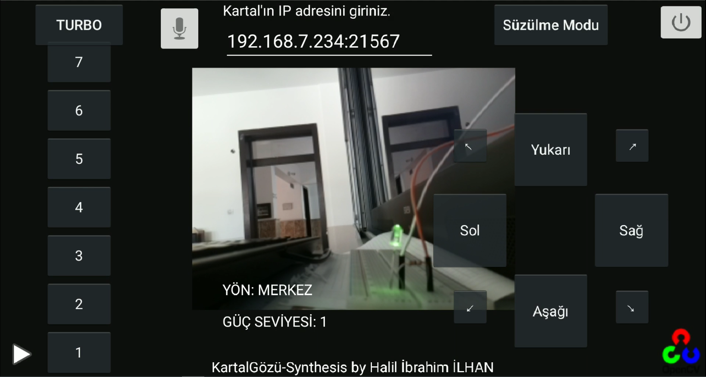
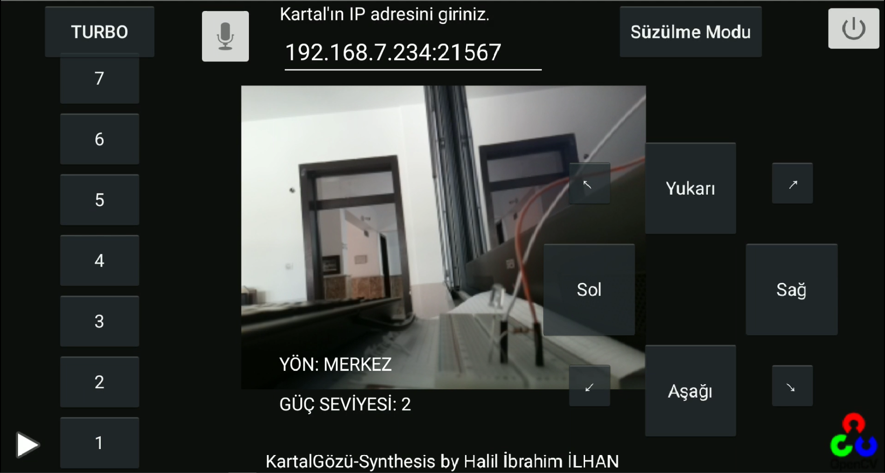

# KartalGzSpywareCam
App ID: KartalGözü-Synthesis

Bu uygulama Spycam uygulamasının Spyware uygulamasında arka plana eklenmesiyle oluşturulmuştur. Diğer iki uygulama geliştirilmeye buradan devam edilmiştir.

Özellikleri:

Raspberry Pi tarafında çalışan TCP sunucuya komut paketleri gönderen bu TCP istemci aynı zamanda İHA'dan gelen kamera görüntülerini kontrol panelinin arkaplanında göstermektedir.

[Biological-Formed-Spy-UAV](https://github.com/hybrayhem38/Biological-Formed-Spy-UAV) projesinde kontrolcü olarak kullanılmaktadır.

# Test Görüntüleri
1 ve 2 butonlarına led açma kapama görevi atandı. Raspberry Pi'dan Wifi ile gelen görüntü ekranda gösterildi.

Buton 1: Aç

Buton 2: Kapat

